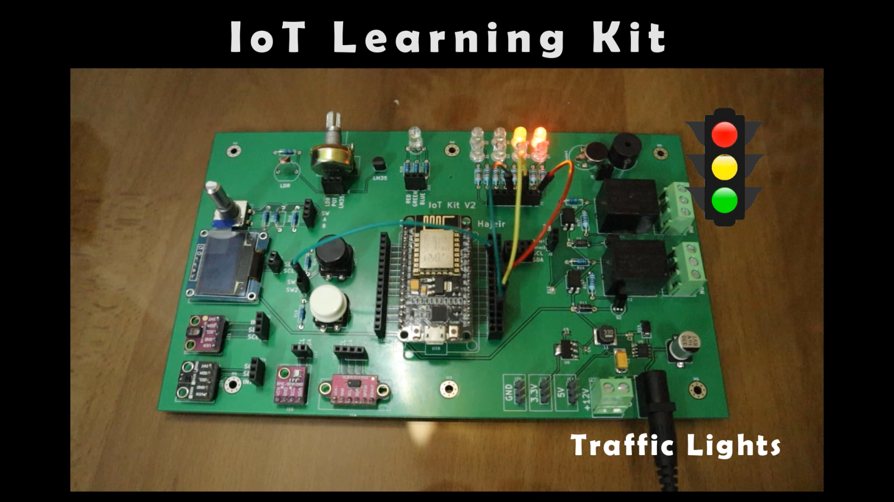

# IoT Learning board

Easening the learning process, abstracts the hardware wiring to the students.  

Demo video of possible applications the board can support:

More information can be found at [the pdf document](IoT_Learning_Kit.pdf).